# HDS (Happy Day Services)

A full-stack monorepo project built with **Clean Architecture** principles, featuring a RESTful API backend and a Next.js frontend for task management and user authentication.

## 🏗️ Architecture Overview

This project follows **Clean Architecture** (Hexagonal Architecture) with clear separation of concerns:

```
┌──────────────────────────────────────────────────────────────┐
│                          Apps Layer                          │
│  ┌─────────────────┐              ┌─────────────────┐        │
│  │   API (Express) │              │   Web (Next.js) │        │
│  │   Controllers   │              │   React UI      │        │
│  │   Routes        │              │   Components    │        │
│  │   Middlewares   │              │   Hooks         │        │
│  └────────┬────────┘              └─────────────────┘        │
└───────────┼────────────────────────────────────────────────-─┘
            │
┌───────────┼──────────────────────────────────────────────────┐
│           │         Core Business Layer                      │
│  ┌────────▼────────┐                                         │
│  │   @hds/core     │                                         │
│  │   - Entities    │  (Domain Models)                        │
│  │   - Use Cases   │  (Business Logic)                       │
│  │   - Interfaces  │  (Contracts)                            │
│  │   - Value Objs  │  (Domain Values)                        │
│  └────────┬────────┘                                         │
└───────────┼──────────────────────────────────────────────────┘
            │
┌───────────┼──────────────────────────────────────────────────┐
│           │         Infrastructure Layer                     │
│  ┌────────▼────────────┐                                     │
│  │  @hds/infrastructure│                                     │
│  │  - Repositories     │  (Data Access)                      │
│  │  - Services         │  (External Services)                │
│  │  - Database         │  (Knex.js/MySQL)                    │
│  └─────────────────────┘                                     │
└──────────────────────────────────────────────────────────────┘
┌──────────────────────────────────────────────────────────────┐
│                      Shared Layer                            │
│  @hds/shared - Constants, Enums, Types, Validators           │
└──────────────────────────────────────────────────────────────┘
```

### Application Screenshots

#### Dashboard View

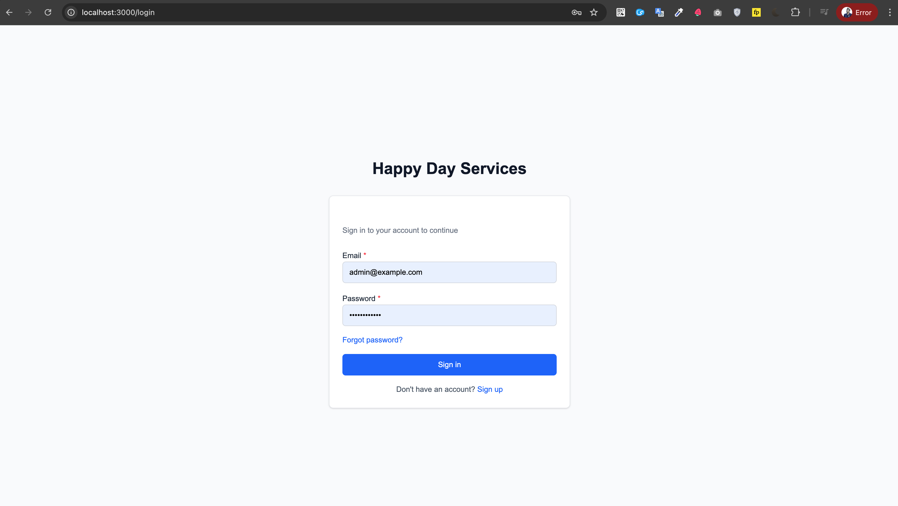

#### Task Management

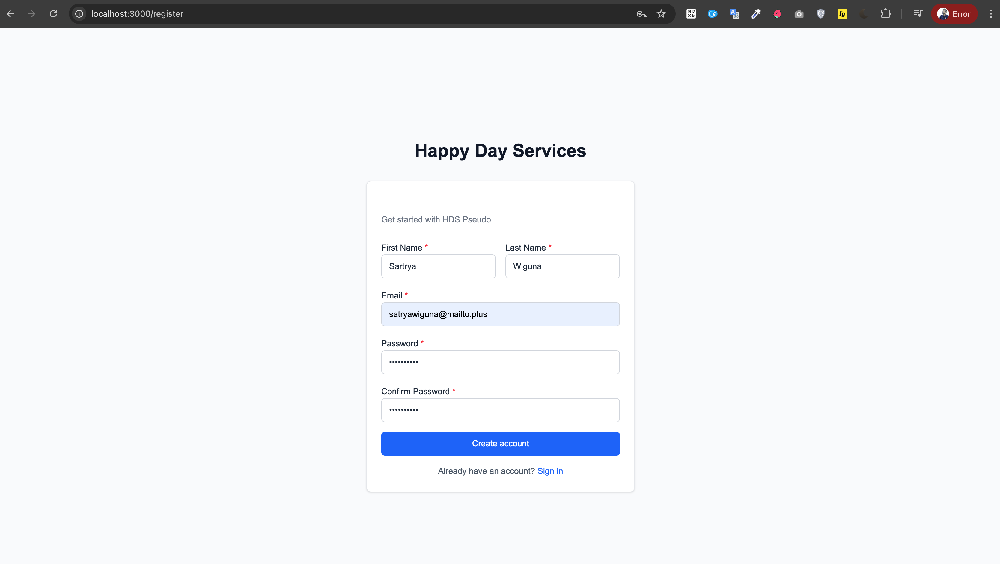

## 📦 Project Structure

```
hds/
├── apps/
│   ├── api/                    # Express.js REST API
│   │   ├── src/
│   │   │   ├── config/        # Configuration (env, db, swagger, logger)
│   │   │   ├── middlewares/   # Express middlewares
│   │   │   ├── modules/       # Feature modules
│   │   │   │   ├── auth/      # Authentication (register, login, verify)
│   │   │   │   ├── user/      # User management
│   │   │   │   └── task/      # Task management
│   │   │   └── main.ts        # Entry point
│   │   └── package.json
│   └── web/                   # Next.js 15 Frontend
│       ├── src/
│       │   ├── app/           # App router pages
│       │   ├── components/    # React components
│       │   ├── hooks/         # Custom React hooks
│       │   ├── lib/           # Utilities & API client
│       │   └── providers/     # Context providers
│       └── package.json
├── packages/
│   ├── core/                  # Business logic (framework-agnostic)
│   │   ├── src/
│   │   │   ├── entities/      # Domain entities (User, Task, Profile)
│   │   │   ├── use-cases/     # Application use cases
│   │   │   ├── interfaces/    # Contracts (repositories, services)
│   │   │   ├── value-objects/ # Value objects (Email, Password)
│   │   │   └── errors/        # Custom error classes
│   │   └── package.json
│   ├── infrastructure/        # Technical implementations
│   │   ├── src/
│   │   │   ├── database/      # Knex migrations & seeds
│   │   │   ├── repositories/  # Data access implementations
│   │   │   └── services/      # External service implementations
│   │   └── package.json
│   └── shared/                # Shared utilities
│       ├── src/
│       │   ├── constants/     # Application constants
│       │   ├── enums/         # Enums (TaskStatus, UserRole)
│       │   ├── types/         # Shared TypeScript types
│       │   ├── utils/         # Utility functions
│       │   └── validators/    # Validation schemas (Yup)
│       └── package.json
├── docker/                    # Docker configurations
│   ├── docker-compose.yml     # Multi-service orchestration
│   ├── api.Dockerfile
│   └── web.Dockerfile
├── tests/                     # Shared test utilities
│   ├── helpers/               # Test builders & mocks
│   └── setup/                 # Jest configuration
├── config/                    # Shared configs (ESLint, Prettier)
├── package.json               # Root workspace configuration
├── pnpm-workspace.yaml        # PNPM workspace definition
└── turbo.json                 # Turborepo pipeline configuration
```

## 🚀 Quick Start

### Prerequisites

- **Node.js** >= 18.x
- **PNPM** >= 8.x
- **Docker** & **Docker Compose** (for containerized setup)
- **MySQL** 8.x (if running locally without Docker)

### Installation

1. **Clone the repository**

```bash
git clone <repository-url>
cd hds
```

2. **Install dependencies**

```bash
pnpm install
```

3. **Environment Setup**

Create a `.env` file in the root directory:

```env
# Node Environment
NODE_ENV=development

# API Configuration
API_PORT=3001
JWT_SECRET=your-super-secret-jwt-key-change-in-production
CORS_ORIGINS=http://localhost:3000,http://127.0.0.1:3000

# Database Configuration
DB_HOST=localhost
DB_PORT=3307
DB_USER=root
DB_PASSWORD=password
DB_NAME=hds_db

# Swagger Documentation
SWAGGER_USER=admin
SWAGGER_PASSWORD=admin123

# Web App Configuration
NEXT_PUBLIC_API_URL=http://localhost:3001
```

### Development Setup

#### Option 1: Docker (Recommended)

```bash
# Build and start all services (MySQL, API, Web, phpMyAdmin)
pnpm docker:build
pnpm docker:up

# Services will be available at:
# - API: http://localhost:3001

# - Web: http://localhost:3000
https://jam.dev/c/650952f1-0a40-44b4-b40f-f0e000e953bf

# - API Docs: http://localhost:3001/api-docs (admin/admin123)
https://jam.dev/c/e6febec5-e2af-4a14-9d60-df4c5569a645

# - phpMyAdmin: http://localhost:8080
```

#### Option 2: Local Development

```bash
# Start MySQL database
pnpm docker:up db

# Run database migrations
pnpm db:migrate

# Optional: Seed database with sample data
pnpm db:seed

# Start all apps in development mode (uses Turborepo)
pnpm dev

# Or start individually
cd apps/api && pnpm dev
cd apps/web && pnpm dev
```

## 📚 Available Scripts

### Root Level (Turborepo)

```bash
# Development
pnpm dev              # Start all apps in watch mode
pnpm build            # Build all packages and apps
pnpm start            # Start production builds

# Code Quality
pnpm lint             # Lint all packages
pnpm type-check       # TypeScript type checking
pnpm test             # Run all tests
pnpm test:unit        # Run unit tests only

# Database
pnpm db:migrate          # Run all migrations
pnpm db:migrate:make     # Create new migration
pnpm db:migrate:rollback # Rollback last migration
pnpm db:seed             # Run database seeders
pnpm db:seed:make        # Create new seeder

# Docker
pnpm docker:build     # Build Docker images
pnpm docker:up        # Start Docker containers
pnpm docker:down      # Stop and remove containers
```

### Package-specific Scripts

```bash
# API Development
cd apps/api
pnpm dev              # Start with hot reload
pnpm build            # Build for production
pnpm start            # Run production build
pnpm test             # Run tests
pnpm test:coverage    # Generate coverage report

# Web Development
cd apps/web
pnpm dev              # Start Next.js dev server
pnpm build            # Build for production
pnpm start            # Start production server
pnpm lint             # Run ESLint

# Core Package
cd packages/core
pnpm build            # Compile TypeScript
pnpm test             # Run unit tests
pnpm test:watch       # Watch mode
pnpm test:coverage    # Generate coverage report

# Infrastructure Package
cd packages/infrastructure
pnpm build            # Compile TypeScript
pnpm test             # Run repository tests
pnpm test:coverage    # Generate coverage report
```

## 🔌 API Documentation

### Accessing Swagger UI

Once the API is running, visit:

- **URL**: http://localhost:3001/api-docs
- **Username**: `admin` (configurable via `SWAGGER_USER`)
- **Password**: `admin123` (configurable via `SWAGGER_PASSWORD`)

#### Swagger UI

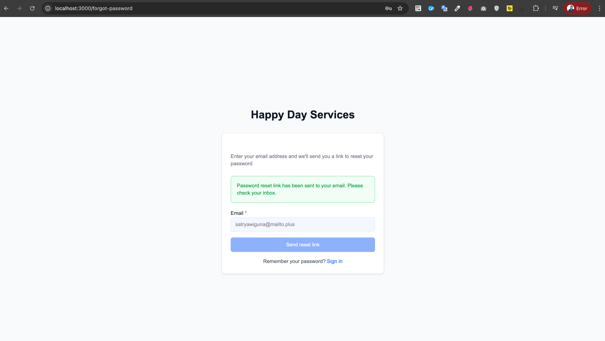

#### Authentication Endpoints

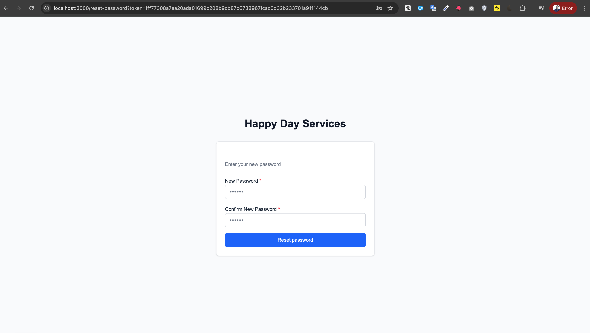

### API Endpoints Overview

#### Authentication (`/api/v1/auth`)

| Method | Endpoint           | Description               | Auth Required |
| ------ | ------------------ | ------------------------- | ------------- |
| POST   | `/register`        | Register new user         | No            |
| POST   | `/login`           | Authenticate user         | No            |
| POST   | `/verify-email`    | Verify email with token   | No            |
| POST   | `/forgot-password` | Request password reset    | No            |
| POST   | `/reset-password`  | Reset password with token | No            |
| POST   | `/refresh-token`   | Refresh access token      | No            |
| POST   | `/logout`          | Logout user               | Yes           |

#### Users (`/api/v1/users`)

| Method | Endpoint | Description               | Auth Required |
| ------ | -------- | ------------------------- | ------------- |
| GET    | `/me`    | Get current user profile  | Yes           |
| GET    | `/`      | Get all users (paginated) | Yes           |
| GET    | `/:id`   | Get user by ID            | Yes           |
| PUT    | `/:id`   | Update user               | Yes           |
| DELETE | `/:id`   | Delete user               | Yes           |

#### Tasks (`/api/v1/tasks`)

| Method | Endpoint | Description              | Auth Required |
| ------ | -------- | ------------------------ | ------------- |
| POST   | `/`      | Create new task          | Yes           |
| GET    | `/`      | Get all tasks (filtered) | Yes           |
| GET    | `/:id`   | Get task by ID           | Yes           |
| PUT    | `/:id`   | Update task              | Yes           |
| DELETE | `/:id`   | Delete task              | Yes           |

#### Health Check

| Method | Endpoint         | Description       | Auth Required |
| ------ | ---------------- | ----------------- | ------------- |
| GET    | `/api/v1/health` | API health status | No            |

### Authentication

The API uses **JWT (JSON Web Tokens)** for authentication. Include the token in the Authorization header:

```
Authorization: Bearer <your-jwt-token>
```

### Authentication Flow

#### Login Screen

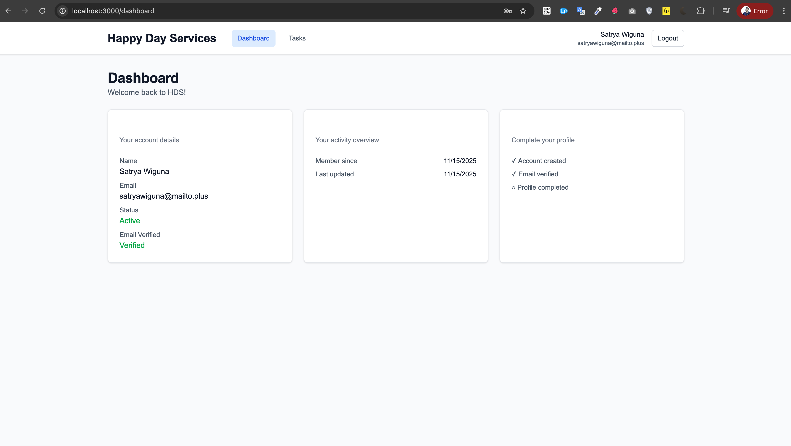

#### Registration Screen

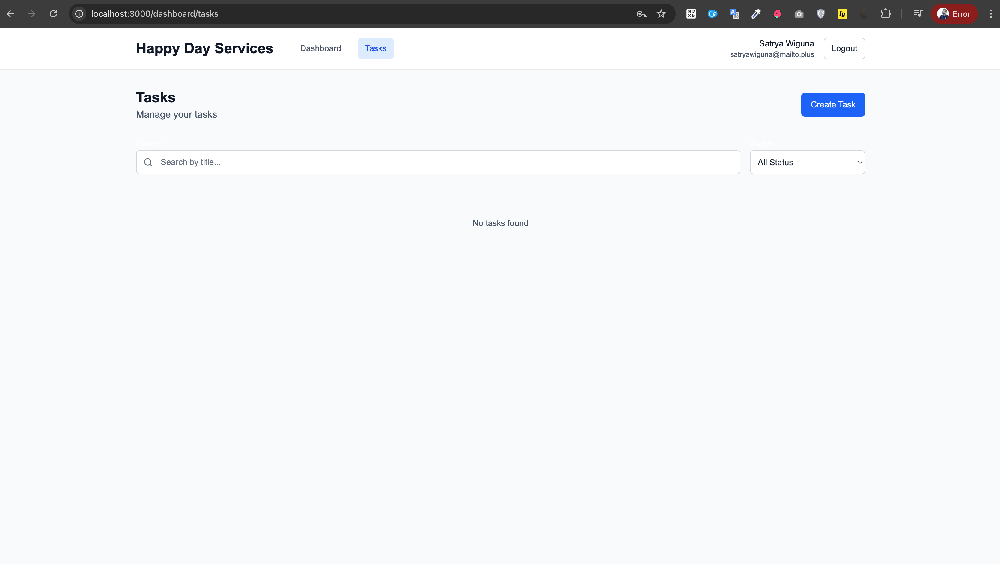

## 🧪 Testing

The project has comprehensive test coverage across all layers.

### Running Tests

```bash
# Run all tests across all packages
pnpm test

# Run only unit tests
pnpm test:unit

# Run tests with coverage (per package)
cd apps/api && pnpm test:coverage
cd packages/core && pnpm test:coverage
cd packages/infrastructure && pnpm test:coverage

# Run tests in watch mode (per package)
cd packages/core && pnpm test:watch
```

### Test Structure

- **Unit Tests**: Test individual components in isolation
  - `packages/core/src/__tests__/unit/` - Business logic tests
  - `packages/infrastructure/src/__tests__/unit/` - Repository tests
  - `apps/api/src/__tests__/unit/` - Controller tests

> **Note**: Integration tests are not yet implemented. The project currently focuses on comprehensive unit test coverage.

### Test Utilities

Located in `tests/helpers/`:

- **Builders**: Create test data objects (`UserBuilder`, `TaskBuilder`)
- **Mocks**: Mock implementations of repositories and services

For detailed testing documentation, see [tests/README.md](tests/README.md).

#### Test Coverage Report

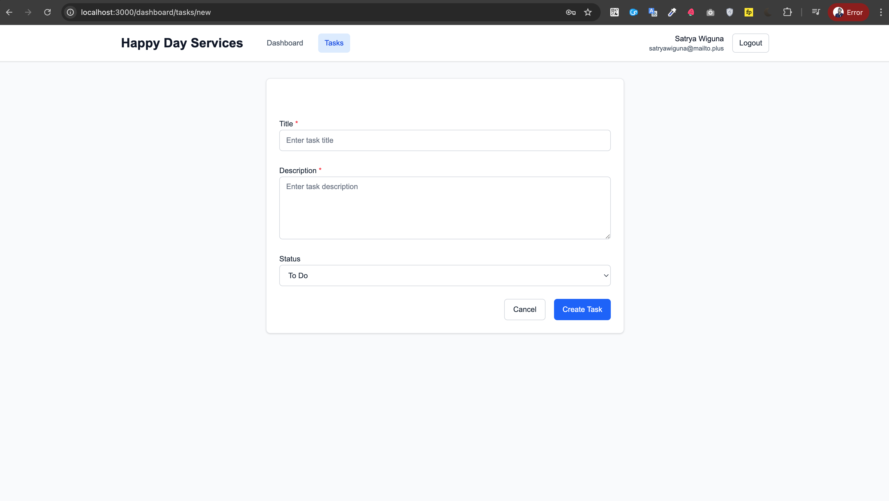

## 🗄️ Database

### Technology

- **Database**: MySQL 8.0
- **Query Builder**: Knex.js
- **Migrations**: Version-controlled schema changes

### Schema Overview

**Users Table**

- User authentication and account information
- Email verification tokens
- Password reset functionality
- Refresh token storage

**Profiles Table**

- Extended user information (first name, last name, phone, avatar)
- One-to-one relationship with Users

**Tasks Table**

- Task management with status tracking
- Created by user reference
- Timestamps for creation and updates

**Task Assignments Table**

- Many-to-many relationship between Tasks and Users
- Tracks who is assigned to which tasks

### Database Commands

```bash
# Create a new migration
pnpm db:migrate:make migration_name

# Run migrations
pnpm db:migrate

# Rollback last migration
pnpm db:migrate:rollback

# Create a new seed file
pnpm db:seed:make seed_name

# Run all seeds
pnpm db:seed
```

### Accessing Database

**Using phpMyAdmin (Docker):**

- URL: http://localhost:8080
- Server: `db`
- Username: `hds_user` (or `root`)
- Password: `password`

**Using MySQL Client:**

```bash
mysql -h 127.0.0.1 -P 3307 -u root -p
# Password: password
```

#### Database Management (phpMyAdmin)

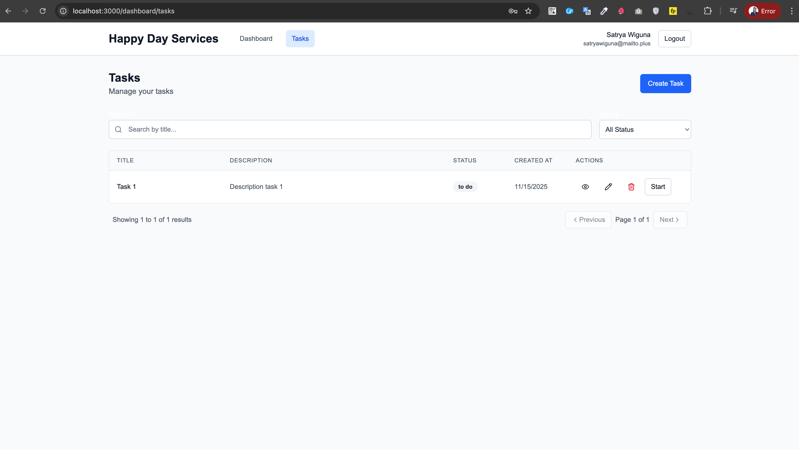

#### Database Schema

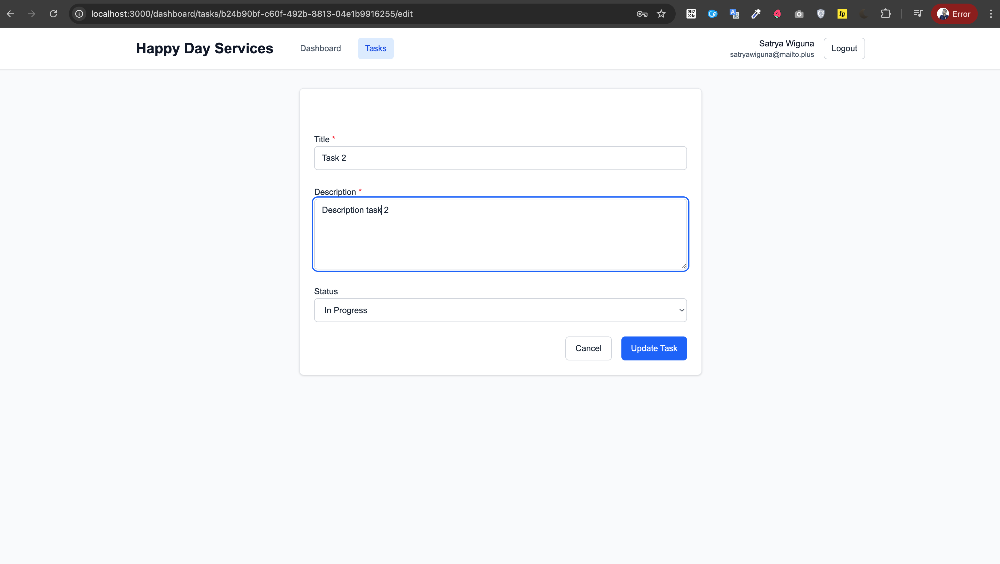

## 🎨 Frontend (Web App)

### Technology Stack

- **Framework**: Next.js 15 (App Router)
- **React**: 19.x
- **Styling**: Tailwind CSS 4.x
- **State Management**: Zustand
- **Data Fetching**: TanStack Query (React Query)
- **Forms**: React Hook Form + Yup validation
- **HTTP Client**: Axios
- **UI Components**: Custom components with class-variance-authority
- **Icons**: Lucide React
- **Notifications**: Sonner

### Key Features

- Server-side rendering (SSR) and static generation
- Authentication with JWT tokens
- Protected routes with middleware
- Responsive design
- Form validation
- Toast notifications
- Loading states and error handling

### Development

```bash
cd apps/web
pnpm dev
# Visit http://localhost:3000
```

### Frontend Features

#### User Profile Management

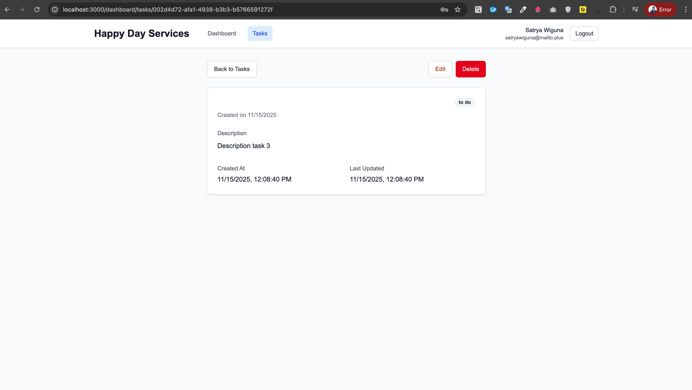

#### Task Details View

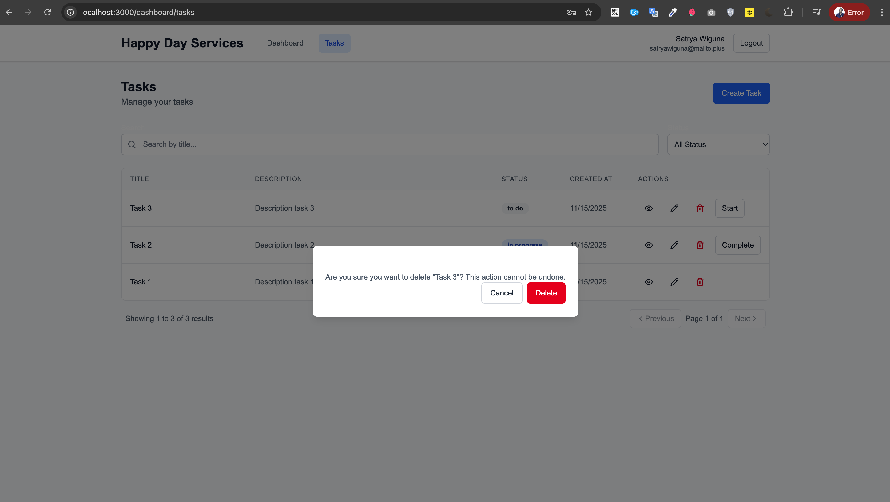

#### Responsive Design

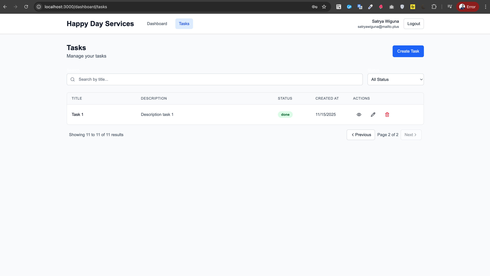

## 🏛️ Clean Architecture Benefits

### 1. **Independence**

- **Framework Independent**: Core business logic doesn't depend on Express, Next.js, or any framework
- **Database Independent**: Can swap MySQL for PostgreSQL by changing infrastructure layer
- **UI Independent**: Can build mobile app, CLI, or different frontend without touching core

### 2. **Testability**

- Business logic is isolated and easy to test
- Mock implementations for all external dependencies
- High test coverage with focused unit tests

### 3. **Maintainability**

- Clear separation of concerns
- Each layer has a single responsibility
- Easy to locate and modify code

### 4. **Scalability**

- Add new features by extending use cases
- Swap implementations without changing business logic
- Package-based structure supports microservices migration

## 🔧 Configuration

### TypeScript

All packages use TypeScript with strict type checking:

- Base config in `tsconfig.json`
- Package-specific configs extend base
- Build configs exclude tests

### ESLint

Shared ESLint configuration in `config/eslint.config.mjs`:

- TypeScript rules
- Import order rules
- Unused variable warnings

### Prettier

Shared Prettier configuration in `config/prettier.config.js`:

- Consistent code formatting
- Integrated with ESLint

### Turborepo

Pipeline configuration in `turbo.json`:

- Optimized task execution
- Caching for faster builds
- Dependency-aware task ordering

## 🐳 Docker Deployment

### Services

The `docker-compose.yml` defines 4 services:

1. **db** (MySQL 8.0)
   - Port: 3307 → 3306
   - Volume: `mysql_data` for persistence
   - Health checks enabled

2. **api** (Express API)
   - Port: 3001
   - Depends on: `db`
   - Runs migrations on startup
   - Optional seeding via `SEED_DB` env var

3. **web** (Next.js)
   - Port: 3000
   - Depends on: `api`

4. **phpmyadmin**
   - Port: 8080
   - Database management UI

### Production Build

```bash
# Build images
docker-compose -f docker/docker-compose.yml build

# Start in detached mode
docker-compose -f docker/docker-compose.yml up -d

# View logs
docker-compose -f docker/docker-compose.yml logs -f

# Stop services
docker-compose -f docker/docker-compose.yml down
```

## 📝 Environment Variables Reference

### API Environment Variables

| Variable         | Description                            | Default                 |
| ---------------- | -------------------------------------- | ----------------------- |
| NODE_ENV         | Node environment                       | `development`           |
| API_PORT         | API server port                        | `3001`                  |
| JWT_SECRET       | Secret for JWT signing                 | `your-secret-key`       |
| CORS_ORIGINS     | Allowed CORS origins (comma-separated) | `http://localhost:3000` |
| DB_HOST          | Database host                          | `localhost`             |
| DB_PORT          | Database port                          | `3307`                  |
| DB_USER          | Database username                      | `root`                  |
| DB_PASSWORD      | Database password                      | `password`              |
| DB_NAME          | Database name                          | `hds_db`                |
| SWAGGER_USER     | Swagger UI username                    | `admin`                 |
| SWAGGER_PASSWORD | Swagger UI password                    | `admin123`              |

### Web Environment Variables

| Variable            | Description     | Default                 |
| ------------------- | --------------- | ----------------------- |
| NEXT_PUBLIC_API_URL | Backend API URL | `http://localhost:3001` |

## 🤝 Contributing

### Development Workflow

1. Create a feature branch
2. Make changes following the architecture
3. Write tests for new features
4. Run linting and type checking
5. Ensure all tests pass
6. Submit a pull request

### Code Style

- Follow TypeScript best practices
- Use meaningful variable and function names
- Write self-documenting code
- Add comments for complex logic
- Keep functions small and focused

### Commit Messages

Follow conventional commits:

- `feat:` New feature
- `fix:` Bug fix
- `docs:` Documentation changes
- `test:` Test additions or changes
- `refactor:` Code refactoring
- `chore:` Maintenance tasks

## 📊 Package Dependencies

### Apps

- **API**: Depends on `@hds/core`, `@hds/infrastructure`, `@hds/shared`
- **Web**: Standalone (calls API via HTTP)

### Packages

- **core**: Depends on `@hds/shared`
- **infrastructure**: Depends on `@hds/core`, `@hds/shared`
- **shared**: No dependencies (base package)

## 🛠️ Technology Stack Summary

### Backend

- **Runtime**: Node.js 20+
- **Framework**: Express.js 4
- **Language**: TypeScript 5.3
- **Database**: MySQL 8.0
- **Query Builder**: Knex.js 3
- **Authentication**: JWT (jsonwebtoken)
- **Validation**: Yup
- **Testing**: Jest + ts-jest
- **Documentation**: Swagger (OpenAPI 3.0)

### Frontend

- **Framework**: Next.js 15
- **UI Library**: React 19
- **Language**: TypeScript 5.3
- **Styling**: Tailwind CSS 4
- **State**: Zustand
- **Data Fetching**: TanStack Query
- **Forms**: React Hook Form
- **HTTP**: Axios
- **Testing**: Jest + React Testing Library

### DevOps

- **Package Manager**: PNPM
- **Monorepo**: Turborepo
- **Containerization**: Docker + Docker Compose
- **Linting**: ESLint
- **Formatting**: Prettier

## 🐛 Troubleshooting

### Database Connection Issues

```bash
# Check if MySQL is running
docker ps | grep mysql

# Check logs
docker logs hds-mysql

# Restart database
pnpm docker:down && pnpm docker:up
```

### Port Already in Use

```bash
# Find process using port 3001
lsof -i :3001

# Kill the process
kill -9 <PID>
```

### Migration Errors

```bash
# Reset database (⚠️ Destructive - drops all data)
pnpm db:migrate:rollback --all
pnpm db:migrate

# Or start fresh with Docker
docker volume rm hds-mysql-data
pnpm docker:up
```

### PNPM Installation Issues

```bash
# Clear PNPM cache
pnpm store prune

# Remove node_modules and reinstall
rm -rf node_modules apps/*/node_modules packages/*/node_modules
pnpm install
```

## 📚 Additional Resources

- [Clean Architecture by Robert C. Martin](https://blog.cleancoder.com/uncle-bob/2012/08/13/the-clean-architecture.html)
- [Express.js Documentation](https://expressjs.com/)
- [Next.js Documentation](https://nextjs.org/docs)
- [Knex.js Documentation](http://knexjs.org/)
- [Turborepo Documentation](https://turbo.build/)
- [PNPM Workspaces](https://pnpm.io/workspaces)

## 📄 License

This project is private and proprietary.

## 👥 Authors

- **Satryawiguna** - Initial work

---

**Happy Coding! 🎉**
